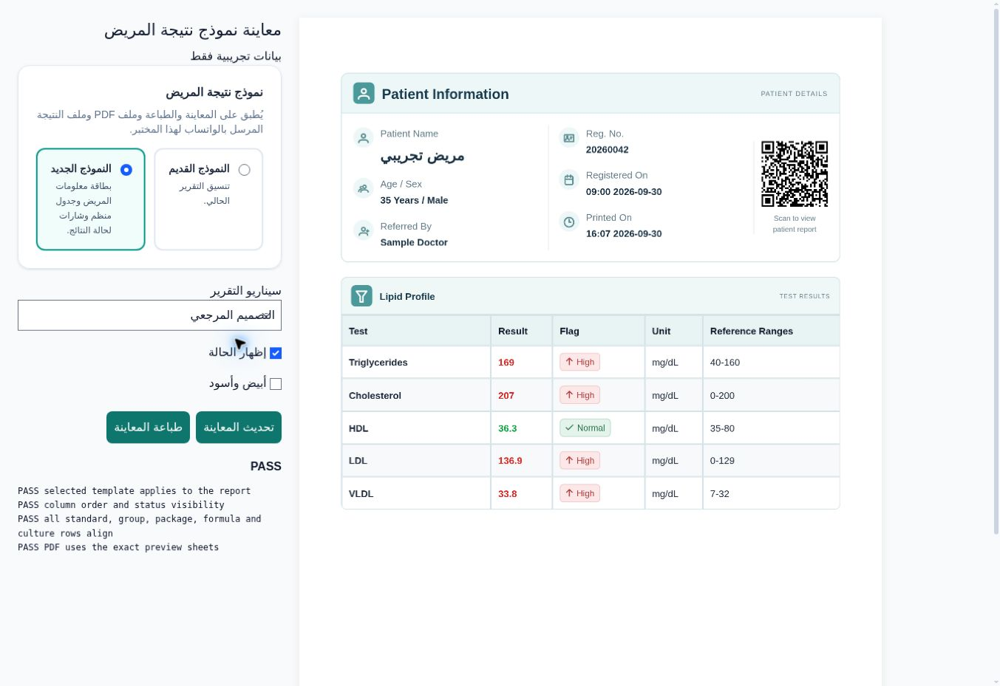

# Selectable medical report template — design QA

final result: passed

Reviewed on 2026-09-30 against the user-supplied patient-information / lipid-profile reference image. All browser records are synthetic; no production patient data was loaded or sent.

## Browser evidence

Cloud Chrome viewport: 1363 × 936 CSS pixels. The screenshot shows the real `print_Result.vue` output produced by the shared A4 renderer, alongside the same picker used in Lab Settings. The reference was inspected alongside the rendered report at comparable content widths.

## Fidelity and integration

- Preserves the reference's pale teal patient card, three information columns, report QR, section bands, alternating rows, and result-adjacent status badges.
- Uses the installed PrimeIcons library and an actual generated QR for the existing report URL. The label says “Scan to view patient report”; it does not claim cryptographic verification.
- Uses existing laboratory font sizes, cell padding, table colors, margins and visibility settings. Density therefore follows the lab's settings instead of hard-coding the reference image's scale. Custom test templates retain their own result layout.
- The original template stays the default; switching back was inspected in the browser.

## Interactions and regression checks

- Switched Original → New → Original and inspected the actual generated report.
- Verified standalone, grouped, packaged, calculated and culture rows; zero results stay visible; optional status columns stay aligned.
- Inspected monochrome output and fixed residual stripe tint. CI also checks that the generated monochrome pixels have equal RGB channels.
- Inspected a 65-row report over five pages, including repeated patient details on a continuation sheet.
- PDF page count matches the preview sheets. Existing native-print and fixed-background regression passes with asymmetric margins and five-page reports.
- Production Vite build and the 11 print/pagination unit tests pass. GitHub Actions supplies MariaDB validation for per-lab persistence, invalid values, staff read-only access, resets and isolation.
- App console errors: none. The cloud browser reported extension metadata errors from a `chrome-extension://` URL; these were unrelated to the app. CI's clean browser checks app console and page errors.

No outstanding P0, P1 or P2 design findings. The preview is a development fixture, not evidence of deployment to the live Hostinger installation.
