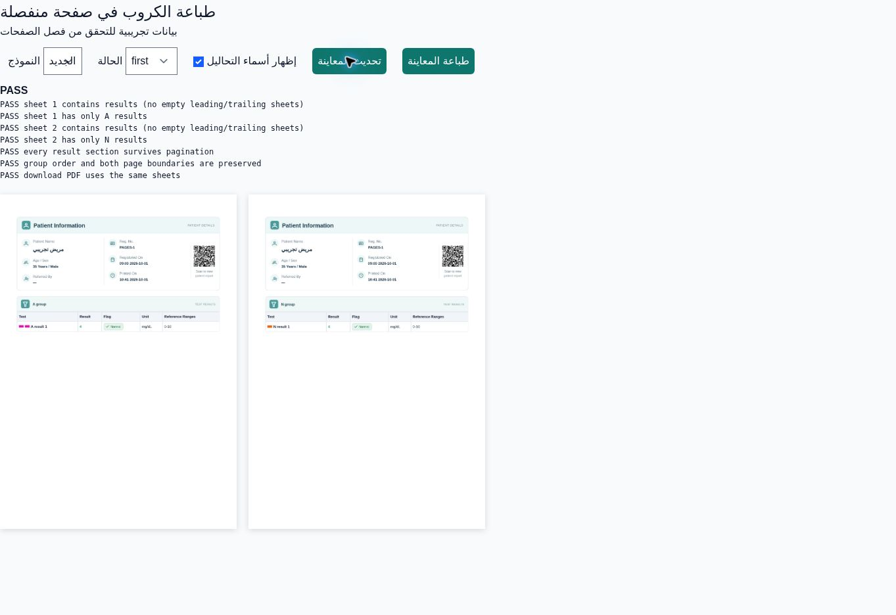

# Dedicated pages for test groups

In **Test groups → Create/Edit**, enable **Print Alone** (طباعة في صفحة منفصلة) and save.

- The group starts a new sheet, and the next results start another sheet.
- A long group continues on pages reserved for that group.
- This also applies to groups inside packages and when test names are hidden, in both classic and modern report templates.
- Patient information, saved margins, backgrounds and the existing signature retain their normal behavior. A first/last isolated group does not force a blank sheet.
- Preview, PDF download, native printing and the PDF prepared for WhatsApp use the same page renderer.
- Turning the setting off restores ordinary pagination. Existing invoices read the current group setting.

No database migration is needed for this fix. Deploy both backend and frontend using the existing Hostinger deployment script; updating the GitHub build branch alone does not update the live site.

## Verification

The browser regression renders the real report component with synthetic data and scans colored test markers in the resulting page images. It covers direct/package groups, first/last/adjacent/long groups, disabled isolation, cultures and patient history in both templates and name-display modes (34 scenarios), and checks PDF/native-print parity. Existing background and report-template regressions also pass.

`GroupReportPagesTest` verifies saving and toggling the option and reading it on existing staff/public invoices, including groups inside packages.

