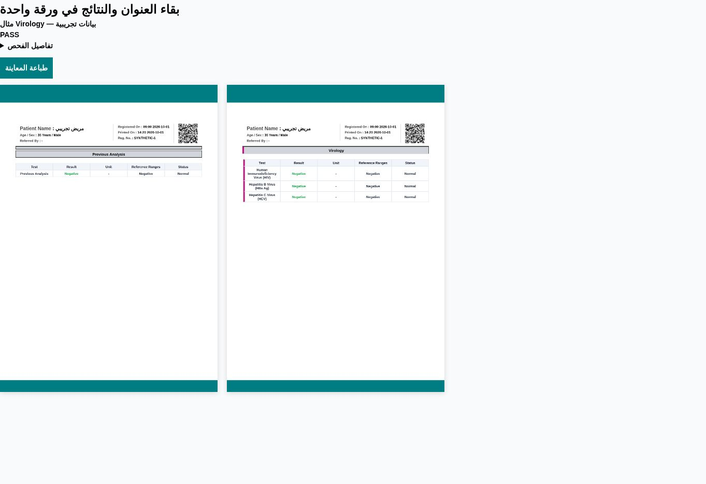

# Keep medical report content together

The shared A4 compositor now measures complete report blocks before slicing the rasterized report. A test, section, group or package range that fits the printable area of one page moves to the next page as a whole when the remaining space is insufficient. Category/name headings and table headers stay with their first complete result. Normal ranges, units and full test names remain within their result row.

Merged tables preserve hidden block identifiers for their constituent groups. Package identifiers connect the package’s flattened tests, attached groups, culture rows and formulas without changing their visible presentation or result values. Explicit page breaks and print-alone group settings take precedence over a surrounding package range.

When a block exceeds a full printable page, it continues at complete row or paragraph boundaries; its heading stack and first result stay together. A single row or image taller than the entire available page must still be split to avoid dropping content or looping. This change does not shrink report text or change the saved margins or background.

The compositor is shared by print, PDF save, preview, WhatsApp file preparation and direct patient report links.

## Verification

- Unit tests cover whole blocks moving, oversized sections, merged/package ranges, explicit breaks and pixel coverage.
- The browser fixture recreates the Virology heading at the end of page one, then checks actual output pixels to confirm its title and all results move to page two.
- Both report designs are tested for single analyses, groups, packages (including formulas/cultures), merged tables, oversized groups and custom templates.
- Each marked result/title must appear on exactly one sheet; PDF and print use those same sheets. Existing form, margin and isolated-group suites remain enabled.
- The fixture uses synthetic patient data only. The user's uploaded patient screenshot is not included in the repository.

After merging, deploy the matching Hostinger build before testing the change on the production website.
