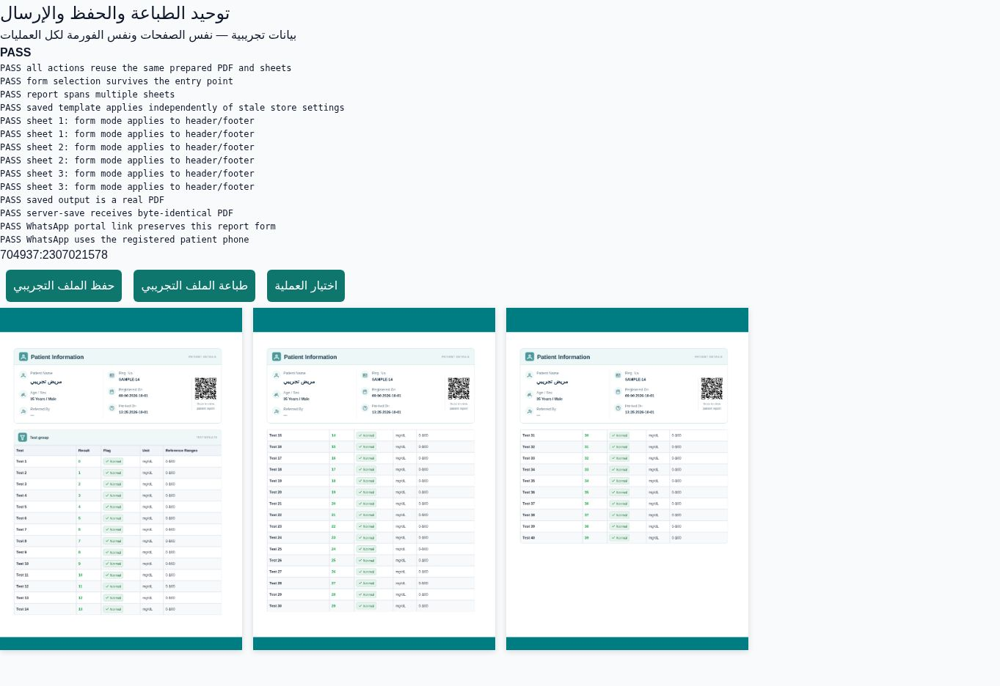

# Unified medical report output

Medical report print layout is the source for preview, PDF download, saved/uploaded PDF and the file prepared for WhatsApp. `print_Result.vue.prepareReport()` prepares the full A4 sheets and PDF once for a given record, settings, form selection and report URL. Staff report actions and direct report links consume that output. It includes the saved classic/modern template, margins, patient header, table styling, background, and group page boundaries.

## Lab form selection

The report action dialog preserves the selected form mode when changing actions or reopening. Direct reports load the invoice lab settings, even when a staff browser has stale settings from a different lab. By default a configured lab form appears; `form=0` explicitly disables it and `form=1` enables it. QR links carry the selected mode. WhatsApp portal links carry `form` and `report` so the choice applies to the shared invoice, without changing other reports in the portal. Signed referral report URLs carry the mode in the fragment to preserve their signed query.

The existing WhatsApp flow downloads the same PDF and opens the registered phone conversation with the patient portal link. The operator attaches the downloaded PDF before sending. No Meta API integration is introduced.

## Save integrity

The invoice PDF upload accepts only actual PDF blobs, keeps the original bytes, and explicitly posts multipart form data despite the API client's JSON default. HTML relabelled as a PDF is rejected. The legacy medical WhatsApp modal also uses the shared report renderer.

## Verification

- Unit tests cover form parsing, ordinary/signed URLs, portal invoice scoping and PDF validation.
- `report-output.browser.mjs` covers classic/modern templates, embedded staff reports, public links, and authenticated direct links, with and without the lab form.
- It compares downloaded/uploaded PDF bytes, preview/print sheet images, background pixels on every page, WhatsApp URL presentation, and action dialog selection persistence.
- Existing report tests continue to cover page margins, fixed backgrounds, template rendering and isolated group pages.
- All test data, patient names, phone numbers and API responses are synthetic; no real messages are sent.

GitHub's Hostinger build produces deployment artifacts. The production site only changes after its normal Hostinger deployment step.
